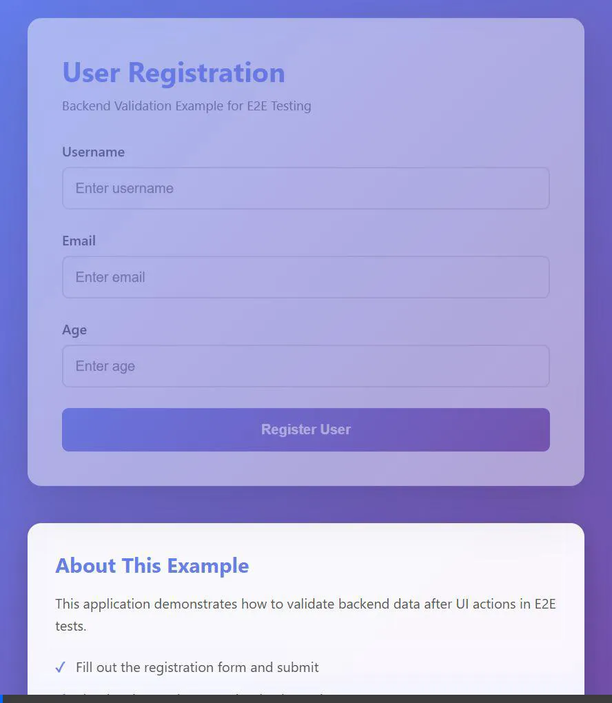

# Backend Data Validation in E2E Tests

A comprehensive example project demonstrating **how to validate backend data after performing UI actions** in End-to-End (E2E) tests using both Cypress and Playwright.

[]()
[]()
[]()

## 📋 Overview

This project showcases a **critical E2E testing pattern**: **UI-to-Backend Validation**. Traditional E2E tests only verify what users see in the UI, but this approach validates that the backend database actually reflects the expected changes after UI interactions.

### The Problem This Solves

❌ **Without Backend Validation:**
- Tests only verify UI appearance
- Backend bugs can slip through undetected
- Data corruption might go unnoticed
- False positives from cached/stale UI data

✅ **With Backend Validation:**
- Ensures data is actually saved correctly
- Catches backend logic errors
- Validates database constraints
- Confirms API responses match database state
- Provides comprehensive test coverage

### What's Included

- 🌐 **User Registration Application** - Full-stack web app with modern UI
- 🔧 **Express REST API** - Backend server with SQLite database
- ✅ **Cypress Test Suite** - 5 comprehensive tests using `cy.request()`
- 🎭 **Playwright Test Suite** - Parallel tests using API request context
- 📚 **Complete Documentation** - Implementation guide and best practices

## 🎯 The Testing Pattern

### Traditional UI-Only Testing (Incomplete)
```javascript
// ❌ Only validates what the UI shows
cy.get('#username').type('testuser');
cy.get('#submitBtn').click();
cy.get('.success-message').should('be.visible');
// What if the data wasn't actually saved to the database?
```

### UI + Backend Validation (This Example)
```javascript
// ✅ Validates both UI AND backend database
cy.get('#username').type('testuser');
cy.get('#submitBtn').click();
cy.get('.success-message').should('be.visible');

// Validate backend data was actually saved
cy.request('GET', '/api/users/1').then((response) => {
  expect(response.status).to.eq(200);
  expect(response.body.user.username).to.eq('testuser');
  expect(response.body.user.email).to.eq('test@example.com');
});
```

## 🎬 Application Demo

### User Registration Flow



**What's happening in the demo:**
1. 👤 User fills out the registration form with username, email, and age
2. 📤 Form is submitted to the backend API (`POST /api/users`)
3. ✅ Backend validates the data and saves to SQLite database
4. 🎉 Success message displays with the registered user information
5. 💾 User data is now stored in the database and can be verified via API

This demo shows the complete flow that our E2E tests validate - both the UI interaction **and** the backend data persistence.

## 🚀 Quick Start

### Prerequisites
- **Node.js** v14 or higher
- **npm** (comes with Node.js)

### Installation

```bash
# Clone the repository
git clone https://github.com/yourusername/backend-validation-example.git
cd backend-validation-example

# Install dependencies
npm install
```

### Running the Application

```bash
# Start the server (runs on http://localhost:3001)
npm start
```

Visit [http://localhost:3001](http://localhost:3001) to see the application in action.

### Running Tests

**Cypress Tests (Interactive Mode)**
```bash
npm run test:cypress:open
```

**Cypress Tests (Headless)**
```bash
npm run test:cypress
```

**Playwright Tests (UI Mode)**
```bash
npm run test:playwright:ui
```

**Playwright Tests (Headless)**
```bash
npm run test:playwright
```

**Run All Tests**
```bash
npm run test:all
```

## 📁 Project Structure

```
backend-validation-example/
├── server.js                           # Express server with SQLite
├── public/
│   ├── index.html                      # Registration form UI
│   ├── styles.css                      # Modern gradient styling
│   └── app.js                          # Frontend JavaScript
├── cypress/
│   ├── e2e/
│   │   └── backend-validation.cy.js    # Cypress E2E tests
│   └── cypress.config.js               # Cypress configuration
├── tests/
│   └── backend-validation.spec.js      # Playwright tests
├── playwright.config.js                # Playwright configuration
├── package.json                        # Dependencies and scripts
├── .gitignore                          # Git ignore rules
└── README.md                           # This file
```

## 🧪 Test Scenarios

Both Cypress and Playwright test suites include **5 comprehensive test scenarios**:

### 1. Basic Registration Validation ✅
- **Flow:** Fill form → Submit → Verify UI → Validate backend
- **Validates:** User data is correctly saved to database
- **Backend Check:** Fetches user by ID and verifies all fields

### 2. Username Lookup Validation ✅
- **Flow:** Create user → Fetch by username from API
- **Validates:** User can be retrieved using different API endpoints
- **Backend Check:** Confirms username-based queries work correctly

### 3. User List Validation ✅
- **Flow:** Create user → Fetch all users → Find created user
- **Validates:** User appears in complete user list
- **Backend Check:** Ensures user is in the database collection

### 4. Duplicate Username Handling ✅
- **Flow:** Create user → Try duplicate → Verify error → Check backend
- **Validates:** Duplicate prevention works correctly
- **Backend Check:** Confirms only original user exists

### 5. Age Validation (Frontend + Backend) ✅
- **Flow:** Submit invalid age → Verify error → Check backend
- **Validates:** Both client and server validation work
- **Backend Check:** Ensures invalid data is NOT saved

## 💡 Implementation Details

### Backend (Express + SQLite)

**Database Schema:**
```sql
CREATE TABLE users (
  id INTEGER PRIMARY KEY AUTOINCREMENT,
  username TEXT NOT NULL UNIQUE,
  email TEXT NOT NULL UNIQUE,
  age INTEGER NOT NULL,
  created_at DATETIME DEFAULT CURRENT_TIMESTAMP
)
```

**Key API Endpoints:**

| Method | Endpoint | Description |
|--------|----------|-------------|
| GET | `/api/users` | Get all users |
| GET | `/api/users/:id` | Get user by ID |
| GET | `/api/users/username/:username` | Get user by username |
| POST | `/api/users` | Create new user |
| DELETE | `/api/users/:id` | Delete user (test cleanup) |

**Validation Rules:**
- Username and email must be unique
- Age must be between 1 and 150
- All fields are required

### Frontend (Vanilla JavaScript)

**Features:**
- Modern gradient UI with animations
- HTML5 form validation
- Real-time error/success feedback
- Responsive design for mobile devices

### Cypress Backend Validation

Cypress uses `cy.request()` to make API calls within tests:

```javascript
// Example: Validate user was created in database
cy.request('GET', `/api/users/${userId}`).then((response) => {
  expect(response.status).to.eq(200);
  expect(response.body.success).to.be.true;
  expect(response.body.user.username).to.eq('testuser');
  expect(response.body.user.email).to.eq('test@example.com');
  expect(response.body.user.age).to.eq(25);
});
```

### Playwright Backend Validation

Playwright uses the `request` fixture for API testing:

```javascript
// Example: Validate user was created in database
const response = await request.get(`/api/users/${userId}`);
expect(response.status()).toBe(200);

const data = await response.json();
expect(data.user.username).toBe('testuser');
expect(data.user.email).toBe('test@example.com');
expect(data.user.age).toBe(25);
```

## 🧹 Test Data Management

Both test suites implement proper cleanup to ensure test independence:

**Cypress Cleanup:**
```javascript
afterEach(() => {
  if (createdUserId) {
    cy.request('DELETE', `/api/users/${createdUserId}`);
  }
});
```

**Playwright Cleanup:**
```javascript
test.afterEach(async ({ request }) => {
  if (createdUserId) {
    await request.delete(`/api/users/${createdUserId}`);
  }
});
```

**Best Practices:**
- Use unique test data (timestamps) to avoid conflicts
- Clean up after each test to maintain independence
- Delete via API to ensure backend cleanup

## 🎓 Key Learnings

After exploring this example, you'll understand:

1. ✅ How to perform UI actions in E2E tests
2. ✅ How to validate backend data using API requests
3. ✅ How to structure tests with proper setup/teardown
4. ✅ How to handle test data cleanup
5. ✅ Differences between Cypress and Playwright API testing
6. ✅ How to validate error scenarios
7. ✅ How to ensure data integrity across UI and backend
8. ✅ How to bypass HTML5 validation for backend testing

## 🛠️ Customization Guide

### Adding New Fields

1. **Update Database Schema** in `server.js`:
   ```javascript
   db.run(`
     CREATE TABLE IF NOT EXISTS users (
       ...existing fields...,
       phone TEXT
     )
   `);
   ```

2. **Add Form Field** in `public/index.html`:
   ```html
   <input type="tel" id="phone" name="phone" required>
   ```

3. **Update Frontend Logic** in `public/app.js`:
   ```javascript
   const formData = {
     ...existing fields...,
     phone: document.getElementById('phone').value
   };
   ```

4. **Update Tests** to validate the new field

### Adding New Test Scenarios

1. Create new test in `cypress/e2e/backend-validation.cy.js`
2. Create corresponding test in `tests/backend-validation.spec.js`
3. Follow the pattern: **UI Action → UI Validation → Backend Validation**

## 📝 Best Practices Demonstrated

1. **Unique Test Data** - Using `Date.now()` timestamps to avoid conflicts
2. **Proper Cleanup** - Deleting test data after each test
3. **Multiple Validation Points** - Checking different API endpoints
4. **Error Scenario Testing** - Validating both success and failure paths
5. **Comprehensive Assertions** - Verifying all relevant fields
6. **Clear Test Structure** - Step-by-step comments explaining flow
7. **HTML5 Bypass Techniques** - Testing backend validation independently

## 🔧 Technology Stack

- **Backend:** Node.js, Express.js, SQLite (sql.js)
- **Frontend:** HTML5, CSS3, Vanilla JavaScript
- **Testing:** Cypress 13.6.2, Playwright 1.40.1
- **Database:** SQLite (in-memory with file persistence)

## 📊 Test Results

```
✓ should validate user data in backend after successful registration (1327ms)
✓ should validate user can be retrieved by username from backend (1192ms)
✓ should validate user appears in all users list (1182ms)
✓ should handle duplicate username error correctly (2483ms)
✓ should validate age validation on both frontend and backend (1180ms)

5 passing (7s)
```

## 🤝 Contributing

This is an educational example project. Contributions are welcome!

**Ideas for contributions:**
- Add more test scenarios
- Enhance the UI with additional features
- Add more API endpoints
- Implement additional validation patterns
- Add database migration examples
- Add authentication/authorization examples

## 📄 License

ISC

## 🙏 Acknowledgments

This project was created to demonstrate best practices in E2E testing with backend validation. It serves as a learning resource for developers looking to improve their testing strategies.

---

**Happy Testing! 🚀**

For questions, issues, or suggestions, please open an issue on GitHub.
